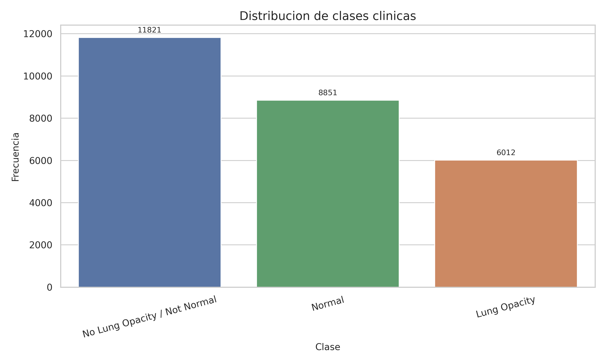
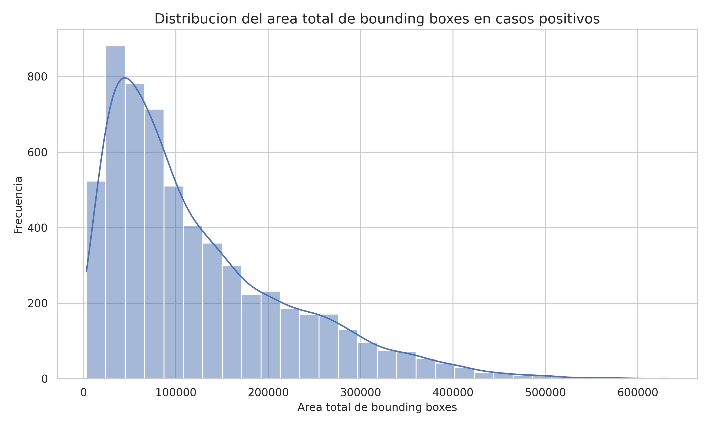
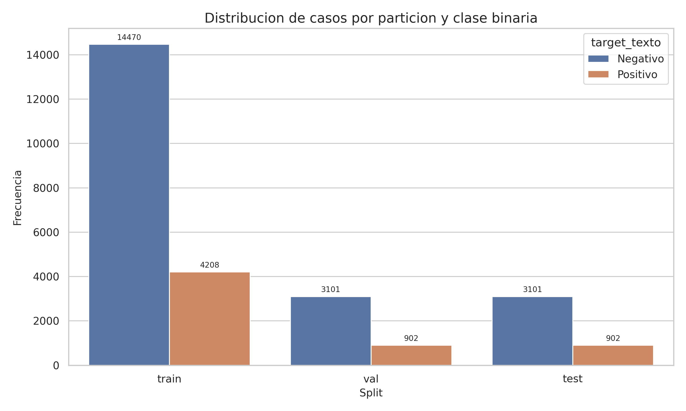
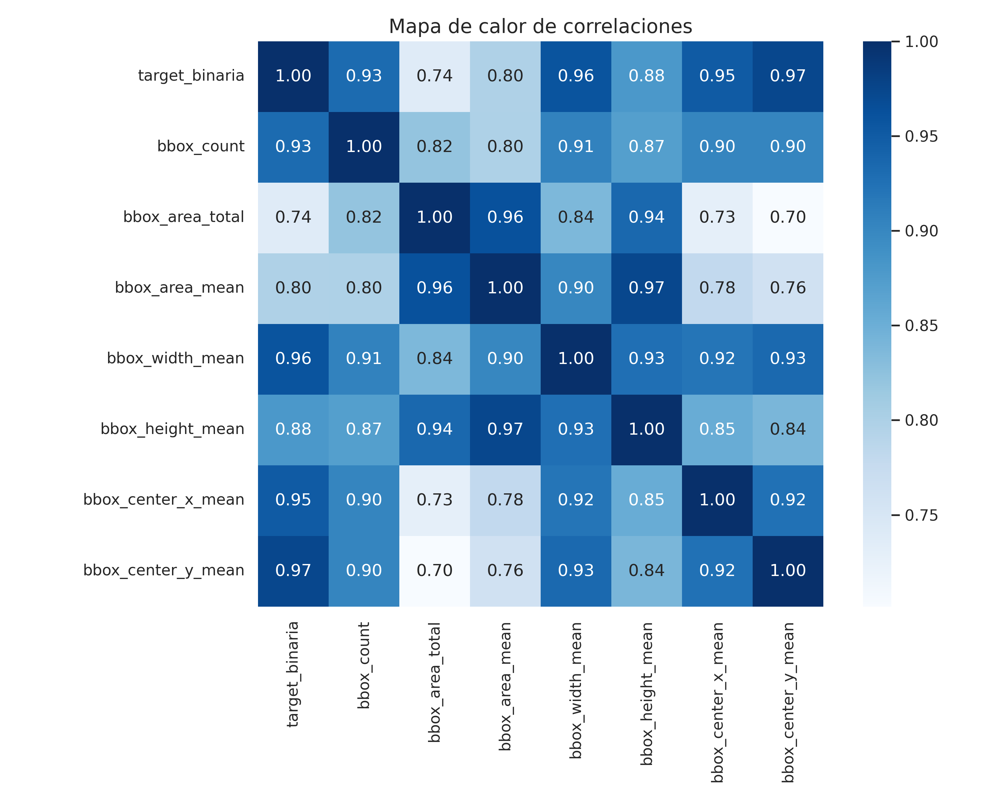
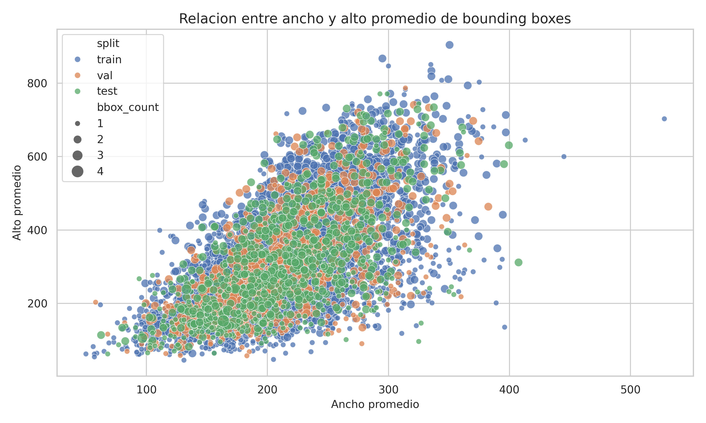

# Análisis Exploratorio de Datos
## Conjunto RSNA Pneumonia Detection Challenge
**Reporte técnico — Actividad de análisis exploratorio**  
Marzo de 2026

---

## 1. Resumen del procesamiento previo

A partir del conjunto de datos público *RSNA Pneumonia Detection Challenge* se ejecutó un pipeline de preprocesamiento que integró tres fuentes de información: las imágenes radiológicas en formato DICOM del conjunto de entrenamiento, el archivo de etiquetas `stage_2_train_labels.csv` y el archivo de clases detalladas `stage_2_detailed_class_info.csv`.

Las transformaciones realizadas fueron:

1. **Verificación de integridad DICOM** — Se revisaron los 26,684 archivos DICOM del split de entrenamiento. Ningún archivo resultó corrupto o ilegible.
2. **Integración de tablas** — Unión de ambos archivos CSV mediante la llave *patientId*, resultando en 37,629 registros a nivel de anotación.
3. **Variable binaria de diagnóstico** — Creación de *target_binaria* (0 = negativo, 1 = positivo).
4. **Validación de bounding boxes** — Verificación geométrica de todas las cajas delimitadoras en casos positivos. Las 6,012 anotaciones resultaron válidas dentro de las dimensiones de sus imágenes.
5. **Partición estratificada** — División en entrenamiento (70 %), validación (15 %) y prueba (15 %), conservando la proporción de clases.

La **base final depurada** quedó conformada por **26,684 pacientes válidos**: 6,012 positivos (22.53 %) y 20,672 negativos (77.47 %), distribuidos en 18,678 registros de entrenamiento, 4,003 de validación y 4,003 de prueba.

---

## 2. Gráficos univariantes

### 2.1 Distribución de clases clínicas

**Figura 1.** Distribución de frecuencias por clase clínica (*n* = 26,684).

La categoría *No Lung Opacity / Not Normal* es la más frecuente con 11,821 registros (44.30 %), seguida de *Normal* con 8,851 (33.17 %) y *Lung Opacity* con 6,012 (22.53 %). Esta distribución evidencia un **desbalance de clases** que deberá considerarse en las etapas de modelado, ya que los casos positivos representan menos de la cuarta parte del total.

### 2.2 Distribución del área total de bounding boxes en casos positivos

**Figura 2.** Histograma del área total de *bounding boxes* en casos positivos (*n* = 6,012).

La distribución es marcadamente **asimétrica hacia la derecha**: la mayoría de los pacientes tienen áreas de lesión relativamente pequeñas, mientras que una minoría presenta opacidades de gran extensión. Este comportamiento sugiere heterogeneidad clínica en la gravedad de las lesiones pulmonares.

---

## 3. Gráficos multivariantes

### 3.1 Distribución de casos por partición y clase binaria

**Figura 3.** Frecuencia de casos positivos y negativos por subconjunto (train / val / test).

El gráfico confirma que la **estratificación fue correcta**: en los tres subconjuntos la proporción de positivos y negativos se mantiene aproximadamente igual, lo que garantiza que los modelos sean evaluados bajo condiciones representativas de la distribución original.

### 3.2 Mapa de calor de correlaciones

**Figura 4.** Matriz de correlaciones de Pearson entre variables numéricas.

Se observa alta correlación entre *bbox_area_total* y las demás dimensiones geométricas (ancho, alto), lo cual es esperable dado que el área es función de ambas dimensiones. La variable *target_binaria* correlaciona de forma notable con todas las métricas de caja, confirmando que sólo los casos positivos poseen anotaciones espaciales.

### 3.3 Dispersión ancho vs. alto de bounding boxes

**Figura 5.** Relación entre ancho y alto promedio de *bounding boxes* por paciente positivo, diferenciando subconjunto de datos.

Se observa una **relación lineal positiva** entre ambas dimensiones en los casos con lesiones más extensas, lo que sugiere que las opacidades más grandes tienden a crecer de forma proporcional en ambas dimensiones.

---

## 4. Resúmenes estadísticos

**Tabla 1.** Resumen estadístico de las variables numéricas (*n* = 26,684).

| Variable | Media | Mediana | Mín. | Máx. | D.E. |
|:---|---:|---:|---:|---:|---:|
| target_binaria | 0.2253 | 0.00 | 0.00 | 1.00 | 0.4178 |
| bbox_count | 0.3581 | 0.00 | 0.00 | 4.00 | 0.7122 |
| bbox_area_total | 27,759.58 | 0.00 | 0.00 | 632,892.00 | 69,708.91 |
| bbox_area_mean | 16,522.06 | 0.00 | 0.00 | 371,184.00 | 38,411.06 |
| bbox_width_mean | 48.71 | 0.00 | 0.00 | 528.00 | 94.22 |
| bbox_height_mean | 70.76 | 0.00 | 0.00 | 904.50 | 149.19 |

**Tabla 2.** Estadísticos de área de *bounding boxes* por grupo diagnóstico.

| Grupo | Pacientes | Proporción | Área total (media) | Área total (mediana) |
|:---|---:|---:|---:|---:|
| Negativo | 20,672 | 77.47 % | 0.00 | 0.00 |
| Positivo | 6,012 | 22.53 % | 123,209.67 | 91,651.50 |

La media de *target_binaria* (0.2253) confirma la prevalencia de aproximadamente una en cuatro observaciones como positivo. Las métricas de áreas muestran medianas de cero —reflejo de que el 77.47 % de los registros no tienen anotación— y desviaciones estándar elevadas, lo que indica alta variabilidad entre los casos positivos.

Al analizar sólo el grupo positivo, cada paciente presenta en promedio **1.59 cajas por estudio** y un **área total media de 123,209.67 píxeles cuadrados**, con mediana de 91,651.50. La diferencia entre media y mediana confirma la asimetría observada en el histograma.

---

## 5. Hallazgo principal del análisis exploratorio

El hallazgo más relevante es la **coexistencia de desbalance de clases y variabilidad espacial intraclase**. La clase positiva (*Lung Opacity*) representa sólo el 22.53 % del conjunto, pero cada paciente positivo contiene en promedio 1.59 lesiones anotadas, con áreas que van desde valores muy pequeños hasta 632,892 píxeles cuadrados.

Esto significa que el problema no es sólo de **clasificación binaria**, sino que también involucra **localización e identificación de regiones con extensión variable**. Estas características implican que las estrategias de modelado deberán contemplar técnicas de *oversampling*, ponderación de clases o pérdidas adaptativas para compensar el desbalance, así como arquitecturas capaces de manejar la heterogeneidad espacial de las lesiones.

---
*Datos generados con `analisis_exploratorio_rsna.py` sobre la base depurada `dataset_limpio_con_split.csv`.*
